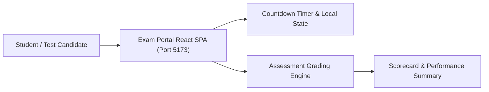
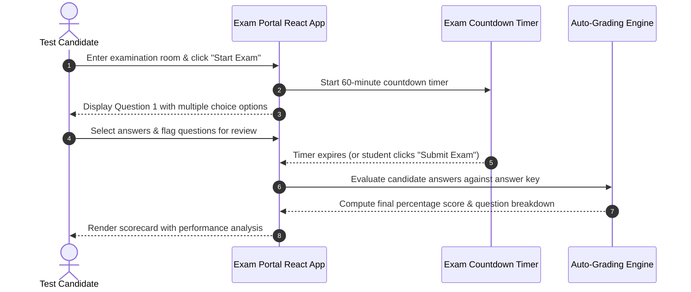

# Online Exam Portal — Academic Assessment Platform
[]()
[]()
[]()
[]()

## Overview
Online Exam Portal is an interactive web-based examination and quiz assessment system built with React 18, Vite, and Tailwind CSS. Developed to modernize university and institutional testing, it provides automated exam timers, randomized question delivery, instant grading, and student performance scorecards.

- **Problem Solved:** Manual paper examination grading and scheduling overhead.
- **Target Users:** Students, academic proctors, faculty, and university departments.
- **Current Status:** Functional Web Application.

## Features
- **Timed Exam Session:** Built-in countdown timer with automated exam submission upon expiration.
- **Question Palette & Navigation:** Quick jump to answered, unanswered, and flagged questions.
- **Immediate Score Calculation:** Instant evaluation and feedback breakdown upon submission.
- **Responsive Layout:** Accessible testing experience across desktop, laptop, and tablet devices.

## Architecture


## User Flow


## Technology Stack
| Layer | Technology | Purpose |
|---|---|---|
| Framework | React 18, Vite | Component tree and fast bundle loading |
| Styling | Tailwind CSS | Clean, distraction-free testing UI |
| State Management | React Context / Hooks | Question state, candidate answers, and timer |

## Infrastructure
- **Development Port:** 5173
- **Hosting Target:** Vercel / Netlify

## Project Structure
```text
Online_exam_portal/
├── src/
│   ├── components/      # QuestionView, TimerHeader, Palette, Scorecard
│   ├── data/            # Question bank datasets and tests
│   ├── App.jsx          # Test lifecycle controller
│   └── main.jsx         # React DOM mounting
├── index.html           # HTML template
├── package.json         # Dependencies
├── vite.config.js       # Vite configuration
├── .gitignore           # Git ignore definitions
└── README.md            # Technical documentation
```

## Prerequisites
- Node.js >= 18.x
- npm >= 9.x

## Environment Variables
Copy `.env.example` to `.env` and configure placeholders:
```env
VITE_EXAM_API_URL=http://localhost:5000/api_optional
```

## Local Development Setup
1. Clone the repository:
   ```bash
   git clone https://github.com/Bhanutejanallamothu/Online_exam_portal.git
   cd Online_exam_portal
   ```
2. Install dependencies:
   ```bash
   npm install
   ```
3. Run development server:
   ```bash
   npm run dev
   ```
4. Access exam portal at `http://localhost:5173`.

## Docker Setup
*Not detected in repository. Static SPA deployable to Nginx.*

## Database Setup
*Not applicable. State managed in client-side memory during test run.*

## API Documentation
*Client-side single-page testing application.*

## Deployment
Build static assets:
```bash
npm run build
```

## Security
- Prevention of accidental back-button navigation during active test sessions.
- In-memory answer validation to prevent candidate tampering.

## Testing
```bash
npm run build
```

## Troubleshooting
- **Exam Auto-Submitted:** Verify browser tab remained focused if anti-cheat tab-switching guards are enabled.

## Future Improvements
- Webcam proctoring with automated face verification (integrating `faceverify`).
- Faculty question authoring and bulk CSV upload.

## License
Academic examination project. All rights reserved by repository owner.
